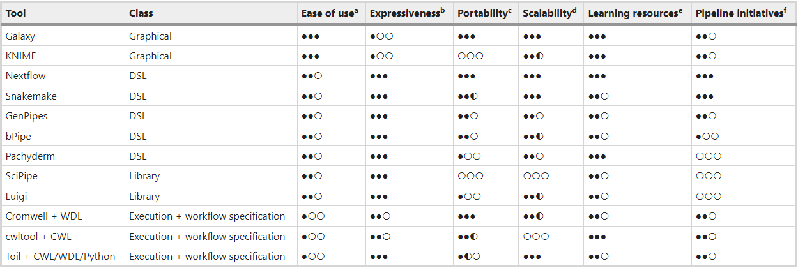

```{css, echo = FALSE}
.remark-slide-content {
  font-size: 28px;
  padding: 20px 80px 20px 80px;
}
.remark-code, .remark-inline-code {
  background: #f0f0f0;
}
.remark-code {
  font-size: 24px;
}
.huge .remark-code { /*Change made here*/
  font-size: 200% !important;
}
.tiny .remark-code { /*Change made here*/
  font-size: 50% !important;
}
```

```{r setup, include=FALSE}
library("reticulate")   # Required for python code chunks
knitr::opts_chunk$set(echo = TRUE,
                      fig.align='center',
                      eval=FALSE)
```

<!-- 
  A Luke Markdown ioslides Theme.
  2022-06-01 v. 1.1
  Contact: Daniel Fischer <daniel.fischer@luke.fi>

  This is free software: you can redistribute it and/or modify
  it under the terms of the GNU General Public License as published by
  the Free Software Foundation, either version 3 of the License, or
  (at your option) any later version.

  This is distributed in the hope that it will be useful,
  but WITHOUT ANY WARRANTY; without even the implied warranty of
  MERCHANTABILITY or FITNESS FOR A PARTICULAR PURPOSE.  See the
  GNU General Public License for more details.

  You can find the GNU General Public License at <http://www.gnu.org/licenses/>.
--> 

# Outline for the Course

## Outline of topics
<div class="my-footer">Outline of topics</div> 

**Background**

1. Motivation for workflow managers
2. What is Snakemake?

# Background

## Motivation for workflow managers I
<div class="my-footer">Motivation for workflow managers I</div> 

<p class="comment">
"Until now, I dealt pretty well with bash!"
</p>

```{r, out.width = "600px", include=TRUE, fig.align="center", fig.cap=c(""), echo=FALSE, eval=TRUE}
knitr::include_graphics("figs/Pills.png")
```

## Motivation for workflow managers II
<div class="my-footer">Motivation for workflow managers II</div> 

There might be a few things that you asked yourself, though:

1. Is my analysis reproducible?
2. Is my analysis script reusable?
3. Can I restart a crashed analysis run?
4. How do I share my analysis with others?
5. Where do I get all the required software from?
6. How do I scale my analysis between my laptop and a HPC?

## Motivation for workflow managers III
<div class="my-footer">Motivation for workflow managers III</div> 

Using a workflow manager, you will find more or less easy answers to previous questions.

Naturally, it requires some efforts to learn how to use a workflow managers, but it pays off!

Unfortunately, the easy answers will come with the price of more complicated questions!

<p class="green">
We are here to solve also new, more complicated questions!
</p>

## Overview of workflow manager
<div class="my-footer">Overview workflow manager</div> 

```{r, out.width = "120%", include=TRUE, fig.align="left", fig.cap=c(""), echo=FALSE, eval=TRUE}

```

<p class="cite">
Wratten, L., Wilm, A. & Göke, J. Reproducible, scalable, and shareable analysis pipelines with bioinformatics workflow managers. Nat Methods 18, 1161–1168 (2021). https://doi.org/10.1038/s41592-021-01254-9
</p>

# Snakemake

## Why Snakemake?
<div class="my-footer">Why Snakemake?</div> 

Why to use Snakemake?

1. It is rather easy to use
2. It is based on Python
3. It uses filenames, so high readability
4. Covers almost any use-case of regular users
5. It straight forward to install

## How to install Snakemake?
<div class="my-footer">How to install Snakemake?</div> 

First, you would need to fulfill the prerequisites 

1. Make sure you have conda installed on your linux box
    
```{bash, eval=FALSE}
$ conda --version
```    

<p class="warning">
If this throws an error, proceed to install conda.
</p>

<p class="green">
If this gives you an version number, you have a working conda environment.
</p>

## How to install Conda?
<div class="my-footer">How to install Conda?</div> 
    
Follow the steps provided here:
<p class="link">
https://docs.conda.io/projects/conda/en/latest/user-guide/install/linux.html
</p>

Essentially, you need to download the software like this:

```{bash, eval=FALSE}
$ wget https://repo.anaconda.com/miniconda/\
       Miniconda3-py39_4.12.0-Linux-x86_64.sh
```

And then run the installation script

```{bash, eval=FALSE}
$ bash Miniconda3-py39_4.12.0-Linux-x86_64.sh
```    

## Install Snakemake via Conda?
<div class="my-footer">Install Snakemake via Conda</div> 
    
If conda is available on the system, it is very easy to install conda

```{bash, eval=FALSE}
$ conda create -c conda-forge -c bioconda -n snakemake snakemake
```

Activate the newly created environment

```{bash, eval=FALSE}
$ conda activate snakemake
```

And test it

```{bash, eval=FALSE}
(snakemake)$ snakemake --version
```

## Snakemake on CSC/Puhti
<div class="my-footer">Snakemake on CSC/Puhti</div> 

* I asked from CSC support, if they could install snakemake into the default installation

* It was made available a few months ago, is not the latest version but still good enough to live with

* After login to Puhti you can load the `bioconda/3`-module and you are good to go:
```{bash, eval=FALSE}
$ module load bioconda/3
```

# Breakout: Exercise 1

# Basics of Snakemake

## Hello World I
<div class="my-footer">Hello World I</div> 

Introductions to programming typically start with an "Hello World"-example

It shows the easiest way to make the language do something. 

Let us start with the Snakemake "Hello World"-example

## Hello World II
<div class="my-footer">Hello World II</div> 

```{pyhton}
rule all:
    input: "hello-world.txt"
```

This command tells Snakemake to create a file called "hello-world.txt"

So store the above workflow as `hello-world.smk` and run it

```{bash}
snakemake --cores 1  --snakefile hello-world.smk
```

## Hello World III
<div class="my-footer">Hello World III</div> 

We will recive the following error:

```{bash}
Building DAG of jobs...
MissingInputException in line 1 of /home/daniel/course/hello-world.smk:
Missing input files for rule all:
    affected files:
        hello-world.txt
```

## Hello World IV
<div class="my-footer">Hello World IV</div> 

We noticed

* We asked Snakemake to produce a file called "hello-world.txt"
* We have *not* told, how to do it nor have we provided it

We can fix the workflow by providing this missing information

<p class="comment">
We create a rule that provides the missing information
</p>

## Hello World V
<div class="my-footer">Hello World V</div> 

The rule `say_hello` 

* does not have any `input`, hence works 'always'
* has an `output` that matches the `input` in rule `all`

```{python}
rule all:
    input: "hello-world.txt"

rule say_hello:
    output: "hello-world.txt"
    shell:"""
    echo 'Hello World!!!' > hello-world.txt
    """
```


## Hello World VI
<div class="my-footer">Hello World VI</div> 


```{bash}
Building DAG of jobs...
Using shell: /bin/bash
Provided cores: 1 (use --cores to define parallelism)
Rules claiming more threads will be scaled down.
Job stats:
job          count    min threads    max threads
---------  -------  -------------  -------------
say_hello        1              1              1
total            1              1              1

Select jobs to execute...
```` 

(continues on next slide)

---

```{bash}
[Wed Jun  1 10:51:02 2022]
rule say_hello:
    output: hello-world.txt
    jobid: 0
    reason: Missing output files: hello-world.txt
    resources: tmpdir=/tmp

[Wed Jun  1 10:51:02 2022]
Finished job 0.
1 of 1 steps (100%) done
Complete log: .snakemake/log/2022-06-01T105101.905046.snakemake.log
```

## Hello World VII
<div class="my-footer">Hello World VII</div> 

What would happen, if we would have mistyped our output file?

```{python}
rule all:
    input: "hello-world.txt"

rule say_hello:
    output: "hello-world.txt"
    shell:"""
    echo 'Hello World!!!' > Hello-World.txt
    """
```

## Hello World VIII
<div class="my-footer">Hello World VIII</div> 

```{bash}
Building DAG of jobs...
Using shell: /bin/bash
Provided cores: 1 (use --cores to define parallelism)
Rules claiming more threads will be scaled down.
Job stats:
job          count    min threads    max threads
---------  -------  -------------  -------------
say_hello        1              1              1
total            1              1              1

Select jobs to execute...
```

---

```{bash}
[Wed Jun  1 11:09:42 2022]
rule say_hello:
    output: hello-world.txt
    jobid: 0
    reason: Code has changed since last execution
    resources: tmpdir=/tmp

Waiting at most 5 seconds for missing files.
MissingOutputException in line 1 of /home/daniel/course/hello-world.smk:
Job Missing files after 5 seconds. This might be due to filesystem latency.
If that is the case, consider to increase the wait time with --latency-wait:
hello-world.txt completed successfully, but some output files are missing. 0
Shutting down, this might take some time.
Exiting because a job execution failed. Look above for error message
Complete log: .snakemake/log/2022-06-01T110941.918797.snakemake.log
```

## Hello World IX
<div class="my-footer">Hello World IX</div> 

Use directive-placeholders.

```{python}
rule all:
    input: "hello-world.txt"
    
rule say_hello:
    output: "hello-world.txt"
    shell:"""
    echo 'Hello World!!!' > {output}
    """
```

Snakemake will change occurances of `{output}` with the String given in the `output` directive.

## Hello World X - Summary
<div class="my-footer">Hello World X - Summary</div> 

* A Snakemake rule has a **name** and a number of directives, like `input`, `output` and `shell`

* `input` and `output` directives are followed by lists of files that are expected to be used or created by the rule

* In the `shell` directive, we can refer to elements of the rule via curly braces notation, e.g. by `{input}` and `{output}`

* In case we have more lines in a directive, Snakemake will concatenate them in curly braces notation, separated by a whitespace

## Unrolling the rule all I
<div class="my-footer">Unrolling the rule all I</div> 

We could run our workflow also without the `rule all`

```{python}
rule say_hello:
    output: "hello-world.txt"
    shell:"""
    echo 'Hello World!!!' > {output}
    """
```

```{bash}
snakemake --cores 1 --snakefile hello-world.smk hello-world.txt
snakemake --cores 1 --snakefile hello-world.smk say_hello
```

## Unrolling the rule all II
<div class="my-footer">Unrolling the rule all II</div> 

* You can specify a target file and Snakemake checks for the required rules to generate the file

* Snakemake also accepts rule names as targets

* If no target is given, Snakemake defines the first rule of the Snakefile as the target

* Hence, it is best practice to have a rule `all` at the top of the workflow which has all desired target files as input files

# Breakout: Exercise 2

# Wildcards

## Bioinformatics example I
<div class="my-footer">Bioinformatics example I</div> 

Lets create a basic bwa alignment workflow and store it as bwa_align.smk

```{python}
rule bwa_map:
    input:
        "data/genome.fa",
        "data/samples/A.fastq"
    output:
        "mapped_reads/A.bam"
    shell:
        "bwa mem {input} | samtools view -Sb - > {output}"
```

## Bioinformatics example II
<div class="my-footer">Bioinformatics example II</div> 

You can use Snakemake to align the fastq to the genome by running:

```{bash}
snakemake -c1 -s bwa_align.smk mapped_reads/A.bam
```

<br> <br> 
<p class="warning">
The `input` gets now a list as input (remember the `,` in the `input` directive!)
</p>


## Bioinformatics example III
<div class="my-footer">Bioinformatics example III</div> 

```{bash}
Building DAG of jobs...
Using shell: /usr/bin/bash
Provided cores: 1 (use --cores to define parallelism)
Rules claiming more threads will be scaled down.
Job stats:
job        count    min threads    max threads
-------  -------  -------------  -------------
bwa_map        1              1              1
total          1              1              1

Select jobs to execute...
```

(continues on the next page)
---

```{bash}
[Wed Jun  1 12:41:25 2022]
rule bwa_map:
    input: data/genome.fa, data/samples/A.fastq
    output: mapped_reads/A.bam
    jobid: 0
    resources: tmpdir=/local_scratch/fischerd

[M::bwa_idx_load_from_disk] read 0 ALT contigs
[M::process] read 25000 sequences (2525000 bp)...
[M::mem_process_seqs] Processed 25000 reads in 0.910 CPU sec, 0.911 real sec
[main] Version: 0.7.17-r1188
[main] CMD: bwa mem data/genome.fa data/samples/A.fastq
[main] Real time: 1.273 sec; CPU: 0.946 sec
[Wed Jun  1 12:41:26 2022]
Finished job 0.
1 of 1 steps (100%) done
Complete log: /users/fischerd/tmp/fischerd/.snakemake/log/2022-06-01T124123.778979.snakemake.log
```

# Exercise 3

## Wildcards I
<div class="my-footer">Wildcards I</div> 

* We used until now hard-coded filenames

* Typically, we would like to have our workflow to be universal

* We can generalise rules by using named wildcards

* That allows us to use rules universal for different files

* For that we can use `{sample}`

* Snakemake derives the correct substitute for it, based on the requested output

* It does that by going backwards, from the requested output file and changes then the remianing dependencies accordingly

## Wildcards II
<div class="my-footer">Wildcards II</div> 

The variable part of the file names are exchanged to `{sample}`

```{python}
rule bwa_map:
    input:
        "data/genome.fa",
        "data/samples/{sample}.fastq"
    output:
        "mapped_reads/{sample}.bam"
    shell:
        "bwa mem {input} | samtools view -Sb - > {output}"
```

## Wildcards III
<div class="my-footer">Wildcards III</div> 

Using the generalised rules, we can then just call the workflow as we did before

```{bash}
snakemake -c1 -s bwa_align.smk mapped_reads/C.bam
```

Also bash-magic can be used to define output files

```{bash}
snakemake -c1 -s bwa_align.smk mapped_reads/{A,B,C}.bam
```

## Wildcards IV
<div class="my-footer">Wildcards IV</div> 

```{bash}
Building DAG of jobs...
Using shell: /usr/bin/bash
Provided cores: 1 (use --cores to define parallelism)
Rules claiming more threads will be scaled down.
Job stats:
job        count    min threads    max threads
-------  -------  -------------  -------------
bwa_map        1              1              1
total          1              1              1

Select jobs to execute...
```

(continues on the next page)

---

```{bash}
[Wed Jun  1 13:53:38 2022]
rule bwa_map:
    input: data/genome.fa, data/samples/A.fastq
    output: mapped_reads/A.bam
    jobid: 1
    wildcards: sample=A
    resources: tmpdir=/local_scratch/fischerd
[...]
Finished job 1.
1 of 1 steps (100%) done
Complete log: /users/fischerd/tmp/fischerd/.snakemake/log/2022-06-01T135334.947264.snakemake.log
```

# Exercise 4

# Visualisation of DAG and dry-run

## DAG
<div class="my-footer">DAG</div> 

As said, the workflow is constructed using a so-called Directed acyclic graph (DAG)

This graph is calculated in runtime, based on the requested files to be generated.

We will extend our BI workflow with a few rules so that the graph is getting more interesting

## Adding a sorting step
<div class="my-footer">Adding a sorting step</div> 

Typically, after aligning data to the genome, the alignment files need to be sorted. 

````{python}
rule samtools_sort:
    input:
        "mapped_reads/{sample}.bam"
    output:
        "sorted_reads/{sample}.bam"
    shell:"""
      samtools sort -T sorted_reads/{wildcards.sample} \
               -O bam {input} > {output}
    """
```

Within the `shell` directive, one can access the value of the wildcard via `{wildcards.sample}`.

## Adding an indexing step
<div class="my-footer">Adding a indexing step</div> 

Further, a bam file normally needs to be indexed for faster access as well:

```{python}
rule samtools_index:
    input:
        "sorted_reads/{sample}.bam"
    output:
        "sorted_reads/{sample}.bam.bai"
    shell:
        "samtools index {input}"
```

## Visualising the workflow
<div class="my-footer">Visualising the workflow</div> 

We can visualise our workflow in two ways:

1. Each and every step, how our input data moves through the workflow
2. A schematic visualisation of the dependency structure of the plot

Snakemake has options to create both kinds of figures:

1. Use the option `--dag`
2. Use the option `--rulegraph`

Snakemake produces an output in DOT format (graph description language)

## Plotting the DAG
<div class="my-footer">Plotting the DAG</div> 

```{bash}
snakemake --dag -s bwa_align.smk sorted_reads/{A,B,C}.bam.bai | \
dot -Tsvg > dag.svg
```

```{r, out.width = "600px", include=TRUE, fig.align="center", fig.cap=c(""), echo=FALSE, eval=TRUE}
knitr::include_graphics("figs/dag.svg")
```


## Plotting the Rulegraph
<div class="my-footer">Plotting the DAG</div> 

```{bash}
snakemake --rulegraph -s bwa_align.smk sorted_reads/{A,B,C}.bam.bai | \
dot -Tsvg > rulegraph.svg
```

```{r, out.width = "190px", include=TRUE, fig.align="center", fig.cap=c(""), echo=FALSE, eval=TRUE}
knitr::include_graphics("figs/rulegraph.svg")
```

## Dry-run
<div class="my-footer">Dry-Run</div> 

During development and testing it is not feasible to run always the pipeline.

To test, if the DAG can be constructed, you can perform a **dry-run**

Here, the execution of the pipeline is simulated and no code is executed.

The option for that is `-n` or `--dry-run`

It is often advisable to combine the dry-run with the `-p`-option. This option
prints the generated commands also to the screen.

# Exercise 5

# The expand function

## Expand function I
<div class="my-footer">Expand-function I</div> 

It happens often that we need to use more than one sample as input.

Snakemake provides for this the helper function `expand()`

If we define e.g. the Python list

```{python}
SAMPLES = ["A", "B"]
```

we can enter it to the `expand()` function like this


## Expand function II
<div class="my-footer">Expand-function II</div> 

Using a python list `SAMPLES` in the `expand()` function

```{python}
expand("sorted_reads/{sample}.bam", sample=SAMPLES)
```

gives as output a list like this

```{python}
["sorted_reads/A.bam", "sorted_reads/B.bam"]
```

This works also via several lists as input!

## Expand function III
<div class="my-footer">Expand-function III</div> 

Using two input lists

```{python}
expand("sorted_reads/{sample}.{replicate}.bam", sample=SAMPLES, replicate=[0, 1])
```

gives all combinations in a list like this:

```{python}
["sorted_reads/A.0.bam", "sorted_reads/A.1.bam",
 "sorted_reads/B.0.bam", "sorted_reads/B.1.bam"]
```

## Variant calling
<div class="my-footer">Variant calling</div> 

Why do we need to mention both, `bam` and `bai`?

```{python}
rule bcftools_call:
    input:
        fa="data/genome.fa",
        bam=expand("sorted_reads/{sample}.bam", sample=SAMPLES),
        bai=expand("sorted_reads/{sample}.bam.bai", sample=SAMPLES)
    output:
        "calls/all.vcf"
    shell:
        "bcftools mpileup -f {input.fa} {input.bam} | "
        "bcftools call -mv - > {output}"
```

Please, notice also the named input!

# Exercise 6

# Own scripts

## Using own scripts I
<div class="my-footer">Using own scripts I</div> 

We often would like to apply also own scripts to the data, e.g to plot the quality scores of the variant calling

We store in the following in the python script in `scripts/plot-qual.py`

```{python}
import matplotlib
matplotlib.use("Agg")
import matplotlib.pyplot as plt
from pysam import VariantFile

quals = [record.qual for record in VariantFile(snakemake.input[0])]
plt.hist(quals)

plt.savefig(snakemake.output[0])
```

## Using own scripts II
<div class="my-footer">Using own scripts II</div> 

And call the script then in another rule like this:

```{python}
rule plot_quals:
    input:
        "calls/all.vcf"
    output:
        "plots/quals.svg"
    script:
        "scripts/plot-quals.py"
```

## Using own scripts III
<div class="my-footer">Using own scripts III</div> 

Of course, the script could be also placed into the `shell` directly.

That is bad, as it merges the workflow logix with the script logic.

Having the scripts separately, we can share scripts between different workflows!

# Exercise 7

# Target rules
## Target rules I
<div class="my-footer">Target rules I</div> 
We learned earlier that Snakemake by default uses the first rule as target.

Hence, it is good practice to define a rule `all` that has all the desired output as `input` to generate it

In our case, this would be

```{python}
rule all:
    input:
        "plots/quals.svg"
```

## Target rules II
<div class="my-footer">Target rules II</div> 

We also said that snakemake takes rules as target in the call

That said, we can define subsets of interesting targests to generate by having different rules, e.g.

* all
* QC
* Alignment
* ...

# Exercise 8

# Thank you!
 
## {.centered}
<div class="my-footer"></div> 

Please reach out if you feel you would need support or would like to join the network!

# References

---

Wratten, L., Wilm, A. & Göke, J. Reproducible, scalable, and shareable analysis pipelines with bioinformatics workflow managers. Nat Methods 18, 1161–1168 (2021). https://doi.org/10.1038/s41592-021-01254-9